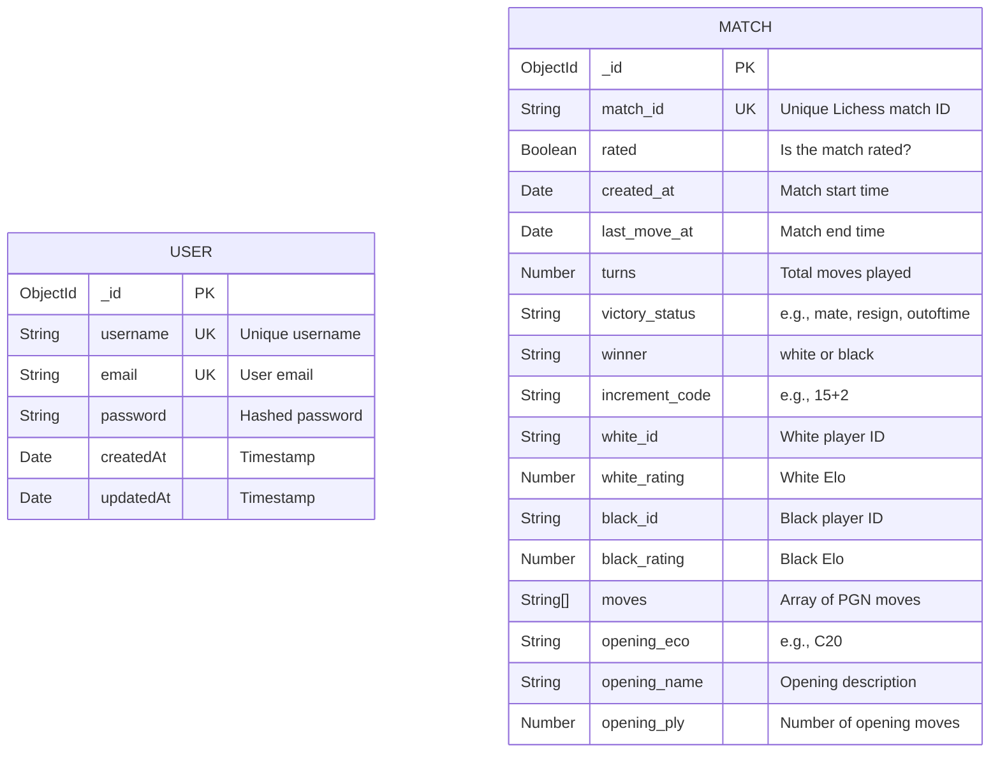
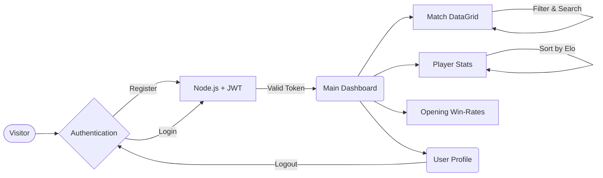

<div align="center">
  

  <h1>♟️ Grandmaster Analytics</h1>
  <p><strong>An Enterprise-Grade Full-Stack Platform for Deep Chess Match Analysis</strong></p>

  [](https://reactjs.org/)
  [](https://vitejs.dev/)
  [](https://tailwindcss.com/)
  [](https://redux-toolkit.js.org/)
  [](https://nodejs.org/)
  [](https://mongodb.com/)
  <br />
  [](https://chess-game-dataset-harshit-kumar.vercel.app)
  [](https://chess-game-dataset-harshit-kumar.onrender.com)
  [](https://documenter.getpostman.com/view/50839854/2sBXwtqpxw)
  [](LICENSE)

  > **Grandmaster Analytics** is a robust, beautifully designed data analytics dashboard that processes massive datasets of professional chess matches. It transforms raw PGN data into actionable intelligence through a glassmorphism-inspired interface—featuring interactive charts, player trends, opening win-rates, and powerful filtering capabilities.

  🌐 **Frontend Live Demo:** [chess-game-dataset-harshit-kumar.vercel.app](https://chess-game-dataset-harshit-kumar.vercel.app)  
  ⚙️ **Backend API URL:** [chess-game-dataset-harshit-kumar.onrender.com](https://chess-game-dataset-harshit-kumar.onrender.com/)  
  📖 **API Documentation:** [Postman Collection](https://documenter.getpostman.com/view/50839854/2sBXwtqpxw)
</div>

---

## 📑 Table of Contents

- [Project Overview](#-project-overview)
- [Tech Stack](#-tech-stack)
- [Key Features](#-key-features)
- [Full-Stack Architecture](#-full-stack-architecture)
- [Database Schema](#-database-schema)
- [Interactive Workflow](#-interactive-workflow)
- [Getting Started](#-getting-started)
- [API Overview](#-api-overview)
- [Scripts](#-scripts)
- [Project Structure](#-project-structure)
- [Implementation Checklist](#-implementation-checklist)

---

## 📋 Project Overview

### What It Is
Grandmaster Analytics is a comprehensive data analysis platform built for chess enthusiasts, players, and data analysts. It consumes a vast MongoDB dataset of chess matches and surfaces powerful insights through:
- **Interactive Visualizations:** Beautiful charts for opening win rates, player performance trends, and match statistics.
- **Deep Match Filtering:** Search and filter thousands of games by Elo ratings, time controls (Bullet, Blitz, Rapid), or victory status.
- **Secure Authentication:** Full JWT-based user authentication, ensuring sensitive data and heavy queries are protected.

### Why It Exists
Raw chess data (like CSV or PGN files) is notoriously difficult to read and extract value from. This platform bridges that gap by offering an intuitive visual interface where users can seamlessly query complex Lichess data without writing a single line of SQL or NoSQL. 
- Real data aggregations are shown on every screen.
- Overcomes the limitation of static chess databases by allowing dynamic UI interactions.

### Who It's For
| Audience | What They Can Do |
|---|---|
| **Chess Players** | Discover the highest win-rate openings and analyze overall player trends. Compare time controls and Elo performance. |
| **Data Analysts** | Filter matches by specific Elo thresholds, time controls, and victory conditions to extract statistical insights. |
| **Developers** | Consume the well-documented REST API, review Mongoose aggregation pipelines, or spin up their own local instance. |

---

## 🛠 Tech Stack

<details open>
<summary><strong>🎨 Frontend</strong> — <code>frontend/</code></summary>
<br>

| Layer | Technology | Purpose |
|---|---|---|
| **Framework** | React + Vite | Component-based UI with lightning-fast HMR and optimized builds |
| **State Management** | Redux Toolkit | Predictable global state (Authentication, UI Theming) |
| **Routing** | React Router | Seamless SPA navigation with lazy loading and protected auth guards |
| **Styling** | Tailwind CSS | Utility-first CSS powering the sleek glassmorphism design |
| **HTTP Client** | Axios (with interceptors) | Automatic JWT Bearer token injection, 401 handling, and secure API requests |
| **Visuals** | Framer Motion (Optional) | Smooth page transitions and interactive micro-animations |
</details>

<br>

<details open>
<summary><strong>⚙️ Backend</strong> — <code>backend/</code></summary>
<br>

| Layer | Technology | Purpose |
|---|---|---|
| **Runtime** | Node.js + Express.js | High-performance HTTP server and REST API routing |
| **Database** | MongoDB + Mongoose | NoSQL database with rigid schemas and powerful aggregation pipelines |
| **Authentication** | JSON Web Tokens (JWT) + bcryptjs | Secure, stateless authentication to protect heavy endpoints. Password hashing. |
| **Architecture** | MVC Pattern | Clean separation of Routes, Controllers, and Middlewares |
| **Logging & Security** | Morgan & CORS | Request logging to terminal, cross-origin resource sharing configured for frontend |
</details>

---

## ✨ Key Features

| Area | Details |
|---|---|
| **Authentication System** | Complete JWT-based registration and login. Axios interceptors automatically handle 401 Unauthorized errors to seamlessly log users out. |
| **Interactive Dashboard** | High-level metrics showcasing total games, top players, and most successful openings using beautiful, responsive charts. |
| **Matches Explorer** | A robust list view to filter matches by time control (Bullet, Blitz, Rapid, Classical), Victory Status (Checkmate, Resignation, Time Out), and Elo ratings. |
| **Opening Analytics** | Specialized views that leverage MongoDB aggregations to group matches by opening (ECO code) and calculate win rates (White vs Black vs Draw) instantly. |
| **Player Leaderboards** | Track top performers, analyze their match history, and visualize their Elo trajectories. |
| **Dual Theming & UI** | Fully persisted Light and Dark modes built into Redux, wrapped in a premium glassmorphism aesthetic. Responsive on desktop, tablet, and mobile. |

---

## 🏗 Full-Stack Architecture

```text
┌─────────────────────────────────────────────────────────────────────┐
│                         CLIENT (React SPA)                          │
│                                                                     │
│  ┌──────────┐   ┌────────────┐   ┌──────────┐   ┌───────────────┐  │
│  │   Pages  │──▶│ Components │──▶│ Services │──▶│   Axios API   │  │
│  └──────────┘   └────────────┘   └──────────┘   │  (w/ Tokens)  │  │
│        │              │                         └───────┬───────┘  │
│        ▼              ▼                                 │          │
│  ┌──────────┐   ┌────────────┐                          │          │
│  │  Router  │   │ Redux Store│                          │          │
│  │ (guards) │   │ (Auth/UI)  │                          │          │
│  └──────────┘   └────────────┘                          │          │
└────────────────────────────────────────┼────────────────┼──────────┘
                                         │   HTTP/JSON    │
                                         ▼                ▼
┌─────────────────────────────────────────────────────────────────────┐
│                        SERVER (Express API)                         │
│                                                                     │
│  ┌────────────┐   ┌──────────────┐   ┌────────────┐                 │
│  │ Middleware │──▶│  Controllers │──▶│   Models   │                 │
│  │ (JWT, Err) │   │ (Aggregations)│   │ (Mongoose) │                 │
│  └────────────┘   └──────────────┘   └──────┬─────┘                 │
│        │                                    │                       │
│        ▼                                    ▼                       │
│  ┌────────────┐                      ┌──────────────┐               │
│  │   Routes   │                      │   MongoDB    │               │
│  └────────────┘                      └──────────────┘               │
└─────────────────────────────────────────────────────────────────────┘
```

### Client-Server Contract

- **Base URL (Local):** `http://localhost:5000/api/v1`
- **Base URL (Prod):** `https://chess-game-dataset-harshit-kumar.onrender.com/api/v1`
- **Authentication:** Frontend stores JWT in LocalStorage/Redux. Injected as `Bearer <token>` in the `Authorization` header via Axios.
- **Data Flow:** React Component `useEffects` → Axios Service → Express Route → Middleware (verify token) → Controller → Mongoose Query → JSON response → React State update.

---

## 🗄️ Database Schema



---

## 🔄 Interactive Workflow



### User Journeys

| Journey | Flow |
|---|---|
| **🎯 Casual Explorer** | Register → Dashboard Overview → Openings Analysis → Settings (Dark Mode) |
| **📊 Data Analyst** | Login → Matches List → Filter by `Blitz` and `Checkmate` → Analyze results |
| **♟ Chess Player** | Login → Players Leaderboard → Compare top player Elos → Review their favorite openings |

---

## 🚀 Getting Started

Follow these steps to run Grandmaster Analytics locally on your machine.

### Prerequisites
- **Node.js** (v16 or higher)
- **MongoDB** instance (Local or MongoDB Atlas)
- **Git**

### 1. Clone the Repository
```bash
git clone https://github.com/harshit-kumar-dev/chess_game_dataset_harshit_kumar.git
cd chess_game_dataset_harshit_kumar
```

### 2. Backend Setup
```bash
cd backend
npm install
```
Create a `.env` file in the `backend` directory:
```env
PORT=5000
MONGODB_URI=mongodb://localhost:27017/grandmaster_analytics
JWT_SECRET=your_super_secret_key_12345
```
Start the backend server in development mode:
```bash
npm run dev
# Server running on http://localhost:5000
```

### 3. Frontend Setup
Open a new terminal window:
```bash
cd frontend
npm install
```
Create a `.env` file in the `frontend` directory:
```env
VITE_API_URL=http://localhost:5000/api/v1
```
Start the frontend application:
```bash
npm run dev
# Application running on http://localhost:5173
```

### 4. Verify Setup
```bash
# Verify backend is running
curl http://localhost:5000/api/v1/system/health

# Open frontend in browser
open http://localhost:5173
```

---

## 📡 API Overview

The backend provides a secure, RESTful API. Endpoints requiring authentication must include a valid JWT in the `Authorization` header (`Bearer <token>`).

### 🔐 Authentication
| Method | Endpoint | Description | Auth Required |
|---|---|---|:---:|
| `POST` | `/api/v1/auth/register` | Register a new user account | ❌ |
| `POST` | `/api/v1/auth/login` | Authenticate user and receive JWT | ❌ |
| `GET`  | `/api/v1/auth/profile` | Retrieve the current user's profile | ✅ |

### ♜ Matches
| Method | Endpoint | Description | Auth Required |
|---|---|---|:---:|
| `GET`  | `/api/v1/matches` | Fetch a paginated list of chess matches | ✅ |
| `GET`  | `/api/v1/matches/:id` | Get detailed data for a specific match | ✅ |

### ♟ Players & Openings
| Method | Endpoint | Description | Auth Required |
|---|---|---|:---:|
| `GET`  | `/api/v1/players` | Fetch top players and their statistics | ✅ |
| `GET`  | `/api/v1/openings` | Aggregate the most successful openings | ✅ |

### ⚙️ System
| Method | Endpoint | Description | Auth Required |
|---|---|---|:---:|
| `GET`  | `/api/v1/system/health` | Check the API health status | ❌ |

> **Detailed Request/Response Schemas:** [Postman Collection](https://documenter.getpostman.com/view/50839854/2sBXwtqpxw)

---

## 📜 Scripts

### Client (`frontend/`)
| Script | Command | Description |
|---|---|---|
| **Dev server** | `npm run dev` | Start Vite development server on `:5173` |
| **Build** | `npm run build` | Bundle application for production to `dist/` |
| **Preview** | `npm run preview` | Serve production build locally |

### Server (`backend/`)
| Script | Command | Description |
|---|---|---|
| **Dev server** | `npm run dev` | Start Express server with auto-reloading (via nodemon) |
| **Production** | `npm start` | Start Express server for production |

---

## 📁 Project Structure

```text
chess_game_dataset_harshit_kumar/
│
├── backend/                              # Express.js REST API
│   ├── data/                             # Raw dataset CSV/JSON files
│   ├── src/
│   │   ├── controllers/                  # Route logic and DB aggregations
│   │   ├── middlewares/                  # JWT verification, Error handling, Logger
│   │   ├── models/                       # Mongoose schemas (User, Match)
│   │   ├── routes/                       # Express router endpoints
│   │   └── app.js                        # Server entry point & DB connection
│   └── package.json
│
└── frontend/                             # React (Vite) Single Page App
    ├── public/                           # Static assets
    ├── src/
    │   ├── components/                   # Reusable UI (Sidebar, Tables, Charts)
    │   ├── pages/                        # View components (Dashboard, Login, Settings)
    │   ├── services/                     # Axios API setup with interceptors
    │   └── store/                        # Redux ToolKit slices (Global state)
    ├── vercel.json                       # Vercel SPA routing rules
    └── package.json
```

---

## 🧪 Implementation Checklist

| Criterion | Status |
|---|---|
| Clean separation of concerns between Frontend and Backend | ✅ |
| All data served from MongoDB aggregations | ✅ |
| JWT authentication implemented on sensitive routes | ✅ |
| Axios interceptors handle expired tokens automatically | ✅ |
| Dynamic charts and metrics display correctly on dashboard | ✅ |
| Theme toggle (Light/Dark mode) persists via Redux | ✅ |
| Application is fully responsive across all devices | ✅ |

---

<div align="center">
  <p>Built with ❤️ by <strong>Harshit Kumar</strong></p>
  <p>
    <a href="https://chess-game-dataset-harshit-kumar.vercel.app">Live Demo</a> •
    <a href="https://documenter.getpostman.com/view/50839854/2sBXwtqpxw">API Docs</a> •
    <a href="https://github.com/harshit-kumar-dev">GitHub</a>
  </p>
</div>
